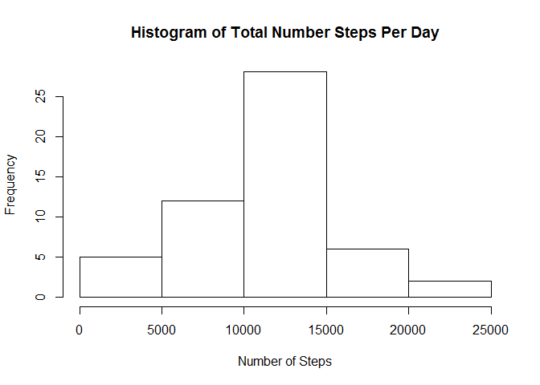
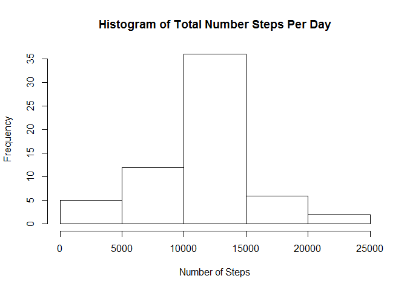
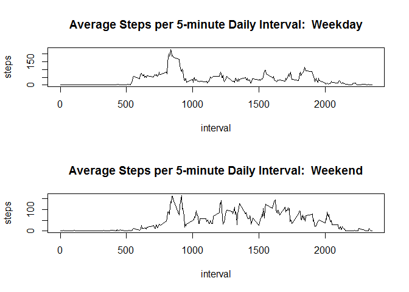

## Loading and preprocessing the data

setwd("~\\datasciencecoursera\\RepData_PeerAssessment1\\RepData_PeerAssessment1")


**Loading Data**

```r
activity<-read.csv("activity.csv")
```

**Examine the structure and format of the data**


```r
str(activity)
```

```
## 'data.frame':	17568 obs. of  3 variables:
##  $ steps   : int  NA NA NA NA NA NA NA NA NA NA ...
##  $ date    : Factor w/ 61 levels "2012-10-01","2012-10-02",..: 1 1 1 1 1 1 1 1 1 1 ...
##  $ interval: int  0 5 10 15 20 25 30 35 40 45 ...
```

```r
head(activity)
```

```
##   steps       date interval
## 1    NA 2012-10-01        0
## 2    NA 2012-10-01        5
## 3    NA 2012-10-01       10
## 4    NA 2012-10-01       15
## 5    NA 2012-10-01       20
## 6    NA 2012-10-01       25
```

**Pre-processing**

Changing the variable *Date* from factor to date type.


```r
library(lubridate)
```

```
## 
## Attaching package: 'lubridate'
```

```
## The following object is masked from 'package:base':
## 
##     date
```

```r
date<-activity$date
date<-ymd(date)
activity<-cbind(activity[,c(1,3)],date)
```

**Re-examine the structure and format of the data**


```r
str(activity)
```

```
## 'data.frame':	17568 obs. of  3 variables:
##  $ steps   : int  NA NA NA NA NA NA NA NA NA NA ...
##  $ interval: int  0 5 10 15 20 25 30 35 40 45 ...
##  $ date    : Date, format: "2012-10-01" "2012-10-01" ...
```

```r
head(activity)
```

```
##   steps interval       date
## 1    NA        0 2012-10-01
## 2    NA        5 2012-10-01
## 3    NA       10 2012-10-01
## 4    NA       15 2012-10-01
## 5    NA       20 2012-10-01
## 6    NA       25 2012-10-01
```

## What is mean total number of steps taken per day?

**Calculate the total number of steps taken per day.**


```r
Total<-aggregate(steps ~ date, data=activity, FUN = function(x) S=sum(x, na.rm = TRUE))
```

**Make a histogram of the total number of steps taken each day**


```r
hist(Total$steps, main = "Histogram of Total Number Steps Per Day",xlab = "Number of Steps")
```

<!-- -->


**3.Calculate and report the mean and median of the total number of steps taken per day**

Mean

```r
mean(Total$steps)
```

```
## [1] 10766.19
```

Median


```r
median(Total$steps)
```

```
## [1] 10765
```


## What is the average daily activity pattern?

**Make a time series plot of the 5-minute interval (x-axis) and the average number of steps taken, averaged across all days (y-axis)**


```r
Ave_int<-aggregate(steps ~ interval, data=activity, FUN = function(x) M=mean(x, na.rm = TRUE))

with(Ave_int, plot(interval, steps, type = "l"))
```

<!-- -->

**Which 5-minute interval, on average across all the days in the dataset, contains the maximum number of steps?**


```r
Ave_int[Ave_int$steps == max(Ave_int$steps),]
```

```
##     interval    steps
## 104      835 206.1698
```

Interval 835 has the highest average number of steps.


## Imputing missing values

**Calculate and report the total number of missing values in the dataset (i.e. the total number of rows with NAs)**


```r
sum(is.na(activity))
```

```
## [1] 2304
```

**Devise a strategy for filling in all of the missing values in the dataset. The strategy does not need to be sophisticated. For example, you could use the mean/median for that day, or the mean for that 5-minute interval, etc.**


Imputation method selected:  Mean by 5-minute interval


**3.Create a new dataset that is equal to the original dataset but with the missing data filled in.**


```r
library(plyr)
```

```
## 
## Attaching package: 'plyr'
```

```
## The following object is masked from 'package:lubridate':
## 
##     here
```

```r
impute.mean <- function(x) replace(x, is.na(x), mean(x, na.rm = TRUE))
CompletedData <- ddply(activity, ~ interval, transform, steps = impute.mean(steps))

CompletedData<-CompletedData[order(CompletedData$date), ] 
```


**4.Make a histogram of the total number of steps taken each day and Calculate and report the mean and median total number of steps taken per day. Do these values differ from the estimates from the first part of the assignment? What is the impact of imputing missing data on the estimates of the total daily number of steps?**


```r
Total<-aggregate(steps ~ date, data=CompletedData, FUN = function(x) S=sum(x, na.rm = TRUE))
```

**Make a histogram of the total number of steps taken each day**


```r
hist(Total$steps, main = "Histogram of Total Number Steps Per Day", xlab = "Number of Steps")
```

<!-- -->

Mean


```r
mean(Total$steps)
```

```
## [1] 10766.19
```

Median


```r
median(Total$steps)
```

```
## [1] 10766.19
```

The mean and median are similar for the pre-imputed and imputed dataset.  The median increased very slightly.

## Are there differences in activity patterns between weekdays and weekends?


**Create a new factor variable in the dataset with two levels - "weekday" and "weekend" indicating whether a given date is a weekday or weekend day.**


```r
Day<-weekdays(CompletedData$date)
CompletedData<-cbind(CompletedData,Day)

CompletedData$Dayind <- ifelse(CompletedData$Day == "Saturday" | CompletedData$Day == "Sunday","Weekend","Weekday")
```

**2.Make a panel plot containing a time series plot of the 5-minute interval (x-axis) and the average number of steps taken, averaged across all weekday days or weekend days (y-axis). See the README file in the GitHub repository to see an example of what this plot should look like using simulated data.**


```r
Weekday<-CompletedData[CompletedData$Dayind == "Weekday",]
Weekend<-CompletedData[CompletedData$Dayind == "Weekend",]
Ave_int_Wday<-aggregate(steps ~ interval, data=Weekday, FUN = function(x) M=mean(x, na.rm = TRUE))
Ave_int_Wend<-aggregate(steps ~ interval, data=Weekend, FUN = function(x) M=mean(x, na.rm = TRUE))

par(mfrow = c(2,1))

with(Ave_int_Wday, plot(interval, steps, type = "l", main = "Average Steps per 5-minute Daily Interval:  Weekday"))
with(Ave_int_Wend, plot(interval, steps, type = "l" , main = "Average Steps per 5-minute Daily Interval:  Weekend"))
```

<!-- -->


